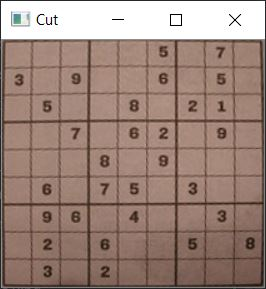
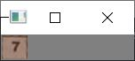
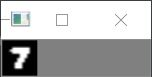

# Sudoku Solver From Image

Extract a sudoku from an image and solve it.

## Installation

This program relies on external packages. To install them you can type in the
following command on your terminal:
```
pip install -r requirements.txt
```
Or alternatively:
```
pip3 install -r requirements.txt
```

## Usage

```
$ python sudoku.py
```

## Pipeline explained
This is the input image.


This input image is first cut out.



This is followed by a loop over the 81 fields of the board. This is for example a detected digit.



After which a so-called mask is placed over it, so that it looks the same as the examples of the 'MNIST' training set.



Now the trained model can be used to detect which digit is here.
So, the image can been converted to an array that looks the same as the sudoku. After this, a simple back-tracking algorithm can solve the sudoku.
